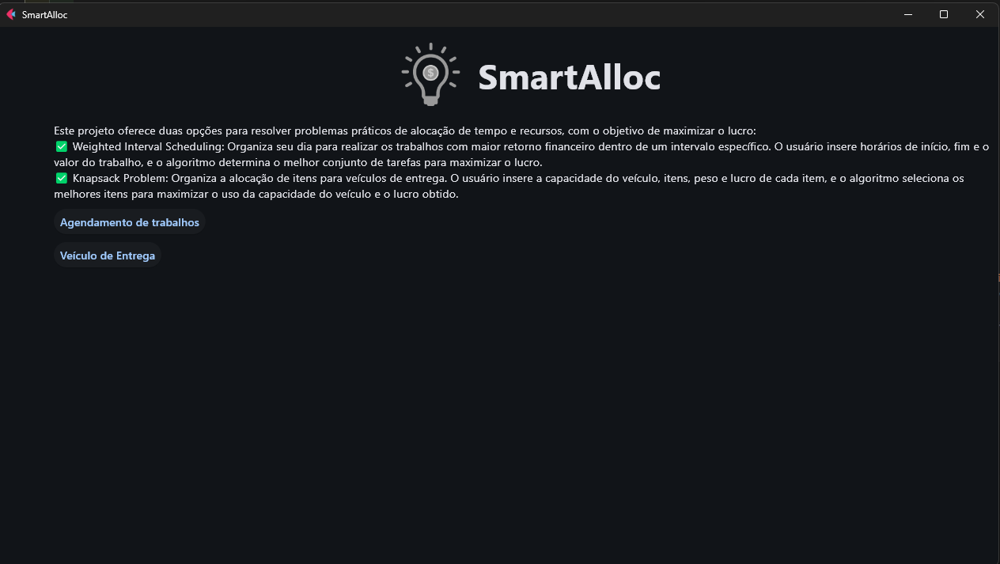
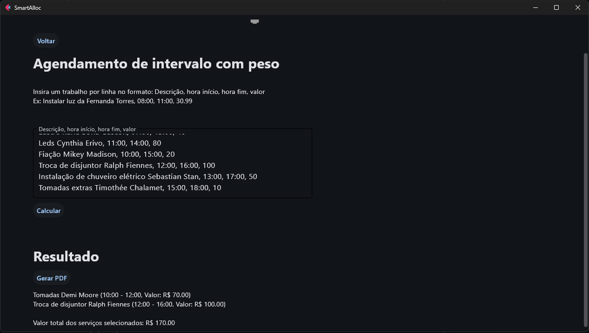
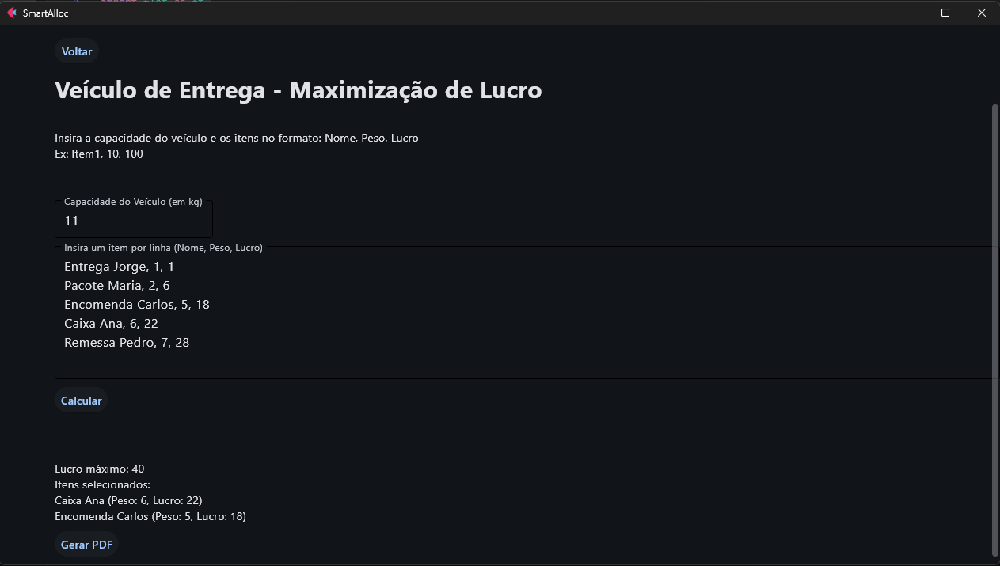
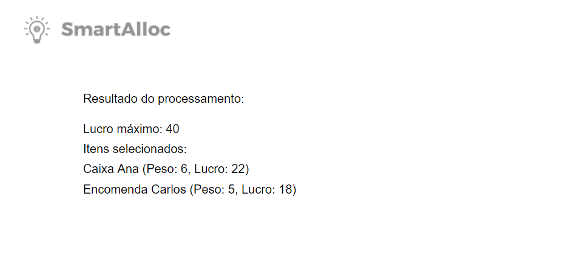

# SmartAlloc

**Número da Lista**: 52<br>
**Conteúdo da Disciplina**: PD<br>

## Alunos
|Matrícula | Aluno |
| -- | -- |
| 22/1031265  |  Carlos Eduardo Rodrigues |
| 22/1037993  |  Patrícia Helena Macedo da Silva |

## Sobre 


Este projeto é uma aplicação em Python que apresenta uma interface gráfica interativa com dois algoritmos do módulo PD. Através dessa aplicação, o usuário pode escolher entre duas opções para resolver problemas práticos de alocação de tempo e recursos visando obter o lucro máximo. Os algoritmos são:

1. ### Weighted Interval Scheduling
O algoritmo de Weighted Interval Scheduling ajuda o usuário a organizar seu dia de forma a realizar os trabalhos que mais retornarão lucro ao final de um intervalo específico. O usuário insere os horários de início,fim e o valor que aquele trabalho vai retornar, e o algoritmo determina o melhor conjunto de tarefas a se realizar, maximizando o lucro dos trabalhos determinados.

2. ### Knapsack Problem
O algoritmo de Knapsack Problem é útil para a organização de alocação de itens, no nosso contexto, itens para veiculos de entrega. O usuário insere a capacidade do veiculo,item, peso e lucro daquel item e o algoritmo seleciona os melhores itens a serem alocados visando encher ao maximo o veiuclo e o lucro. 

## Screenshots






## Vídeo
[apresentação](https://youtu.be/1DcySA6Nk4I)


## Instalação 
**Linguagem**: Python 3.12.7  
**Framework**: (não se aplica, pois não há framework específico)

## Pré-requisitos:
- Python 3.12.7 ou superior
- Bibliotecas: Flet e reportlab

## Como rodar o projeto:

1. Certifique-se de ter o **Python 3.12.7 ou versão superior** instalado em seu sistema. Você pode verificar a versão do Python com o seguinte comando no terminal:

   ```bash
   python --version
   ```

   Caso você não tenha o Python 3.12.7 instalado, faça o download no [site oficial do Python](https://www.python.org/downloads/release/python-3127/).

2. Instale a biblioteca **Flet** utilizando o **pip**. No terminal, execute o seguinte comando:

   ```bash
   pip install flet
   ```

3. Instale a biblioteca **reportlab** utilizando o **pip**. No terminal, execute o seguinte comando:

   ```bash
   pip install reportlab
   ```

4. Rodando o projeto:

   ```bash
   python3 main.py
   ```


## Uso 
1. ### Weighted Interval Scheduling - Maximizar lucro ao final de um período
O algoritmo de Weighted Interval Scheduling ajuda a organizar o dia de forma a realizar as tarefas que mais trarão lucro dentro de um intervalo de tempo específico. Ele seleciona o melhor conjunto de tarefas, maximizando o retorno financeiro, considerando os horários de início, fim e o valor de cada tarefa.

Como usar:
Insira a descrição de cada trabalho, o horário de início,o horário final e o valor de cada uma delas. O formato deve ser:
Exemplo: 
```
Tomadas Carla, 14:00, 18:00,40
(isso significa que o trabalho relacionado as tomadas da Carla começa às 14:00,termina às 18:00 e retornam 40 reais ao trabalhador).
```
Após inserir todos os trabalhos, clique no botão "Calcular".
O algoritmo irá ordenar os tarefas de forma a maximizar o lucro total do periodo, respeitando os horários de início e término inseridos.
A agenda será exibida, mostrando quais tarefas você pode realizar e em que horários, sem sobreposição.
Exemplo de uso:

```
Luz Fernanda Torres, 08:00, 11:00, 30
Tomadas Demi Moore, 10:00, 12:00, 70
Lustre Karla Sofía Gascón, 07:00, 13:00, 40
Leds Cynthia Erivo, 11:00, 14:00, 80
Fiação Mikey Madison, 10:00, 15:00, 20
Troca de disjuntor Ralph Fiennes, 12:00, 16:00, 100
Instalação de chuveiro elétrico Sebastian Stan, 13:00, 17:00, 50
Tomadas extras Timothée Chalamet, 15:00, 18:00, 10
```
Após calcular, o algoritmo irá te mostrar a sequência de trabalhos que você pode fazer para lucrar ao máximo, sem sobreposição de horários. Você pode baixar um pdf com os resultados do agendamento clicando no botão "Baixar pdf".

2. ### Knapsack Problem - Alocação de itens
O algoritmo do problema da mochila (Knapsack Problem) organiza a alocação de itens, no nosso contexto, itens para veículos de entrega, selecionando os melhores itens a serem alocados, visando maximizar o preenchimento do veículo e o lucro.

Como usar:
Primeiramente insira a capacidade máxima do veiculo.
Insira o nome do item, seu peso e seu valor:
Exemplo:
```
11
Entrega1, 5, 18 
```
Após inserir todos os itens, clique no botão "Calcular".
O algoritmo irá selecionar quais itens alocar para aproveitar o espaço da mochila de forma mais inteligente.
Exemplo de uso:

 ```
11
Entrega Jorge, 1, 1
Pacote Maria, 2, 6
Encomenda Carlos, 5, 18
Caixa Ana, 6, 22
Remessa Pedro, 7, 28
 ```

